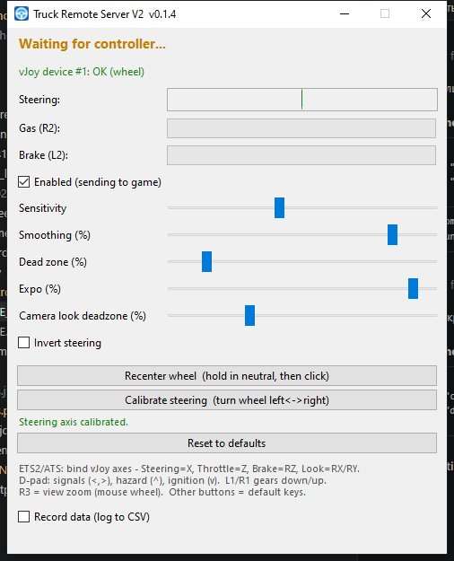

# Truck Remote Server V2 — gamepad + gyro

Drive **Euro Truck Simulator 2 / American Truck Simulator** with a
**DualShock 4** or **DualSense** over **Bluetooth** (or USB). The controller's
**gyroscope is the steering wheel** — hold the pad like a wheel and tilt it.

> Русская версия: [README_ru.md](README_ru.md)



---

## How it works

The steering, pedals and camera go through a **vJoy** device; the buttons
emulate the game's **default keyboard shortcuts** (and one mouse action). Because
vJoy is a generic DirectInput device, ETS2/ATS treats its steering axis as a
real **wheel** — full lock-to-lock at any speed, with no gamepad steering assist:

- gyro tilt → **steering** (vJoy X — a real wheel, full lock at any speed)
- R2 / L2 → **throttle / brake** (vJoy Z / RZ axes)
- right stick → **camera look** (vJoy RX / RY axes)
- buttons + d-pad → **default keyboard keys** + a mouse action (no in-game setup)

## What you need

- **vJoy** driver. The app installs and configures it automatically if missing
  (`run.bat` → `setup_vjoy.ps1`).
- A **DualShock 4** or **DualSense** over Bluetooth or USB.
- From source: **Python 3.9+**. Packaged build: nothing extra.

## Run it

- **Packaged:** double-click `dist\TruckRemoteServerV2.exe`
  (install vJoy once via `setup_vjoy.ps1` if you don't have it).
- **From source:** double-click **`run.bat`** — sets up the venv, installs deps,
  installs/configures vJoy if needed, and starts the app.

## Build the .exe

```powershell
powershell -ExecutionPolicy Bypass -File build.ps1
```

Single-file `dist\TruckRemoteServerV2.exe` (PyInstaller). `hidapi` and pyvjoy's
`vJoyInterface.dll` are bundled; the target PC still needs the **vJoy driver**.

## First run (calibrate the wheel)

1. Connect the controller; launch the app (steering should show "active").
2. Hold the pad in your neutral wheel grip and click **Recenter wheel**.
3. Click **Calibrate steering** and turn the wheel **left ↔ right** for ~3 s.
   This locks which rotation axis is "steering", so tilting the pad toward/away
   no longer moves the wheel.

## Set up the game (one time)

Bind the **vJoy axes** in the game; most **buttons need no setup** (they emulate
the game's default keyboard keys):

1. ETS2/ATS → *Options → Controls* → select the **vJoy** device.
2. Bind the axes: **Steering → X**, **Throttle → Z**, **Brake → RZ**,
   **Camera look → RX / RY**. (Don't bind steering to the raw gamepad stick.)

| Control | Action | Sends |
|---------|--------|-------|
| D-pad ← / → | Turn signals | `[` / `]` |
| D-pad ↑ | Hazard lights | F |
| D-pad ↓ | Engine start/stop | E |
| L1 / R1 | Gear down / up | G / R \* |
| R3 (stick click) | View zoom | middle mouse \* |
| Square | Parking brake | Space |
| Triangle | Lights cycle | L |
| Circle | High beam | K |
| Cross | Horn | H |
| L3 | Wipers | P |
| Options | Cruise control | C |
| Share | Air horn | N |
| Touchpad | Attach/detach trailer | T |
| PS | Menu | Esc |

\* Gears and zoom aren't default keyboard actions: enable a manual gearbox and
bind **Shift gear up/down** to `R`/`G`, and make sure view zoom is on the middle
mouse button (default in most setups). Any key above can be rebound in the game.

## Steering tuning (in-app)

- **Recenter wheel** — hold the pad in your neutral grip, then click.
- **Calibrate steering** — turn the wheel left↔right so tilt isn't read as steering.
- **Sensitivity** — how much rotation reaches full lock.
- **Smoothing** — higher = smoother but laggier (kills jitter).
- **Dead zone** — ignore small rotation near center.
- **Expo** — softer near center for a steadier middle, full lock still reachable.
- **Invert steering** — flip left/right.
- **Reset to defaults** — restore the tuned default settings (keeps calibration).

Camera look is always on (right stick), with its own dead zone. Settings save to
`settings.json` next to the app.
