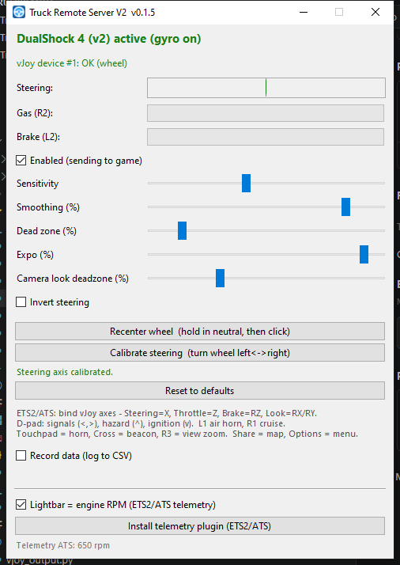

# GamepadTrucker — геймпад + гироскоп

Управление **Euro Truck Simulator 2 / American Truck Simulator** геймпадом
**DualShock 4** или **DualSense** по **Bluetooth** (или USB). **Гироскоп — это
руль**: держи геймпад как руль и наклоняй.


---

## Как это работает

Руль, педали и обзор идут через **vJoy**; кнопки эмулируют **стандартные клавиши
ETS2/ATS** (и одно действие мышью). Так как vJoy — обычное DirectInput-устройство,
игра считает его ось руля настоящим **рулём** → полный ход в обе стороны на любой
скорости, без геймпадного ассиста:

- наклон гироскопа → **руль** (ось vJoy X — настоящий руль, полный ход)
- R2 / L2 → **газ / тормоз** (оси vJoy Z / RZ)
- правый стик → **обзор камеры** (оси vJoy RX / RY)
- кнопки и крестовина → **стандартные клавиши** + действие мышью (без настройки)
- опционально: **подсветка показывает обороты** (зелёный → жёлтый → красный), DualSense и DS4

## Подсветка = обороты двигателя (опционально)

С установленным плагином телеметрии SCS подсветка **DualSense или DualShock 4**
горит зелёным на низких оборотах, жёлтым в средней зоне и красным у отсечки
(белым — пока ждёт игру). Настройка один раз:

1. В приложении нажми **Install telemetry plugin (ETS2/ATS)** (само находит
   установки Steam и копирует `scs-telemetry.dll` в каждую игру).
2. Запусти игру; при первом запуске **разреши** запрос доступа к телеметрии.
3. Едь — подсветка следует за оборотами. Включается галкой
   *Lightbar = engine RPM*.

## Что нужно

- Драйвер **vJoy**. Приложение ставит и настраивает его автоматически, если его
  нет (`run.bat` → `setup_vjoy.ps1`).
- **DualShock 4** или **DualSense** по Bluetooth или USB.
- Из исходников — **Python 3.9+**. Для готового `.exe` — ничего.

## Запуск

- **Готовый:** двойной клик по `dist\GamepadTrucker.exe`
  (если vJoy нет — поставь один раз через `setup_vjoy.ps1`).
- **Из исходников:** двойной клик по **`run.bat`** — создаст venv, поставит
  зависимости, при необходимости установит/настроит vJoy и запустит приложение.



## Сборка .exe

```powershell
powershell -ExecutionPolicy Bypass -File build.ps1
```

Один файл `dist\GamepadTrucker.exe` (PyInstaller). `hidapi` и
`vJoyInterface.dll` из pyvjoy упакованы; на целевом ПК нужен драйвер **vJoy**.

## Первый запуск (калибровка руля)

1. Подключи геймпад, запусти приложение (статус — «active»).
2. Держи геймпад в нейтральном положении руля и нажми **Recenter wheel**.
3. Нажми **Calibrate steering** и ~3 секунды покрути руль **влево ↔ вправо**.
   Это фиксирует, какая ось — «руль», поэтому наклон от себя/к себе больше не
   крутит руль.

## Настройка игры (один раз)

Назначь в игре **оси vJoy**; большинство **кнопок настраивать не нужно** — они
эмулируют стандартные клавиши:

1. ETS2/ATS → *Настройки → Управление* → выбери устройство **vJoy**.
2. Назначь оси: **Руль → X**, **Газ → Z**, **Тормоз → RZ**,
   **Обзор камеры → RX / RY**. (Руль на стик геймпада не вешай.)

| Кнопка | Действие | Шлёт |
|--------|----------|------|
| Тачпад (прожатие) | Гудок | H |
| Крест | Маячок | O |
| Круг | Дальний свет | K |
| Квадрат | Стояночный тормоз | Space |
| Треугольник | Свет (цикл) | L |
| L1 | Тифон | N |
| R1 | Круиз-контроль | C |
| L3 | Дворники | P |
| R3 (клик стика) | Приближение вида | средняя кнопка мыши |
| Крестовина ← / → | Поворотники | `[` / `]` |
| Крестовина ↑ | Аварийка | F |
| Крестовина ↓ | Двигатель вкл/выкл | E |
| Share | Карта | M \* |
| Options | Меню игры | Esc |

\* Карта: привяжи в игре действие *Map* к `M`, если не назначено. Зум вида — на средней
кнопке мыши (обычно так и есть). Любую клавишу выше можно переназначить в игре.

## Настройка руля (в приложении)

- **Recenter wheel** — держи геймпад в нейтрали и нажми.
- **Calibrate steering** — покрути руль влево↔вправо, чтобы наклон не считался рулём.
- **Sensitivity** — какой поворот даёт полный ход.
- **Smoothing** — выше = плавнее, но с задержкой (гасит дрожь).
- **Dead zone** — игнор малых поворотов у центра.
- **Expo** — мягче около центра (спокойнее), полный ход остаётся достижим.
- **Invert steering** — поменять лево/право.
- **Reset to defaults** — вернуть стандартные настройки (калибровка сохраняется).

Обзор камеры всегда включён (правый стик), со своей мёртвой зоной. Настройки
сохраняются в `settings.json` рядом с приложением.
